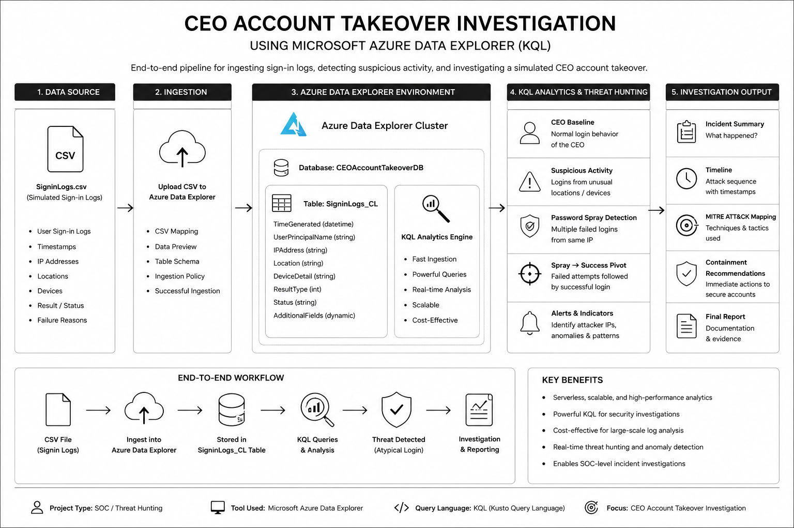

# CEO Account Takeover Investigation — Azure Data Explorer

> **SOC / Threat Hunting Portfolio Project**  
> A reproducible investigation of a simulated CEO account takeover using **Microsoft Azure Data Explorer (ADX)** and **Kusto Query Language (KQL)**.

[](#)
[](#)
[](#)
[](#)

## Overview

This project demonstrates how a SOC analyst can investigate a suspected **CEO account takeover** by ingesting sign-in telemetry into Azure Data Explorer and using KQL to:

1. Establish the CEO's normal authentication baseline.
2. Identify an unusual successful login.
3. Detect a distributed password-spray pattern.
4. Pivot from spray infrastructure to the successful CEO authentication.
5. Build an evidence-backed incident timeline.
6. Map the observed behavior to MITRE ATT&CK.
7. Produce an analyst-style incident report and containment recommendations.

**Important:** The telemetry in this repository is simulated for a safe, reproducible lab. No real company, employee, credential, or production security event is represented.

---

## Architecture



See the detailed architecture notes in [`architecture/ARCHITECTURE.md`](architecture/ARCHITECTURE.md).

### Investigation flow

```text
Local CSV telemetry
        |
        v
Azure Data Explorer
  Database: CEOAccountTakeoverDB
  Table:    SigninLogs_CL
        |
        v
KQL investigation
  ├── CEO baseline
  ├── Suspicious login
  ├── Password spray
  └── Spray → success pivot
        |
        v
Findings / timeline
        |
        v
Incident report + MITRE ATT&CK mapping
```

---

## Dataset

The included dataset contains **262 simulated sign-in events** covering:

| Scenario | Description |
|---|---|
| Password spray | Failed authentication attempts distributed across multiple accounts |
| CEO compromise | Successful CEO authentication from an unusual location/time |
| Comparison event | A successful colleague login used as a benign comparison |

Source dataset: [`data/cloudora_signin_logs.csv`](data/cloudora_signin_logs.csv)

The original JSON representation is retained under [`simulation/simulated-signins.json`](simulation/simulated-signins.json).

### Key fields

| Field | Purpose |
|---|---|
| `TimeGenerated` | Event timestamp |
| `UserPrincipalName` | Account targeted/authenticated |
| `IPAddress` | Source IP |
| `Location` | Source geography |
| `ResultType` | `0` = success; `50126` = invalid username/password |
| `AppDisplayName` | Target application |
| `DeviceDetail_OperatingSystem` | Client operating system |
| `IsInteractive` | Interactive/non-interactive sign-in indicator |
| `CorrelationId` | Event correlation identifier |

---

## Azure Data Explorer setup

The project uses the following naming convention:

- **Cluster:** `ceo-account-takeover-adx`
- **Database:** `CEOAccountTakeoverDB`
- **Table:** `SigninLogs_CL`

> If your Azure portal generated a different cluster name, keep your actual cluster name in Azure. The database/table names above are the project convention used by the KQL in this repository.

### Ingestion workflow

1. Open Azure Data Explorer.
2. Open the `CEOAccountTakeoverDB` database.
3. Create/import the `SigninLogs_CL` table.
4. Upload [`data/cloudora_signin_logs.csv`](data/cloudora_signin_logs.csv).
5. Confirm the column mapping and data types.
6. Verify ingestion with:

```kusto
SigninLogs_CL
| take 10
```

For `TimeGenerated`, use a datetime-compatible type. Numeric `ResultType` should be stored as an integer/long.

**No Microsoft Sentinel is required for this version of the lab.** The investigation is performed directly in Azure Data Explorer with KQL.

---

## KQL investigation

Run the queries in this order:

| # | Query | Purpose |
|---|---|---|
| 01 | [`01-ceo-suspicious-login.kql`](detection-rules/01-ceo-suspicious-login.kql) | Identify the suspicious CEO login |
| 02 | [`02-ceo-baseline.kql`](detection-rules/02-ceo-baseline.kql) | Establish normal CEO behavior |
| 03 | [`03-password-spray-hunt.kql`](detection-rules/03-password-spray-hunt.kql) | Detect distributed password spraying |
| 04 | [`04-spray-to-success-pivot.kql`](detection-rules/04-spray-to-success-pivot.kql) | Link attacker infrastructure to successful access |

The fifth query from the original Sentinel-oriented repository was intentionally removed from the core workflow because the supplied ADX dataset contains **sign-in telemetry only**, not Exchange/OfficeActivity mailbox audit data. This avoids claiming evidence that the dataset cannot actually prove.

---

## Findings

The simulated investigation is designed to demonstrate this attack chain:

**Password spray → credential success → anomalous CEO login → investigation → containment recommendations**

The analyst should validate:

- whether the CEO login is outside the established geographic baseline;
- whether the login occurs outside normal hours;
- whether the source IP participated in earlier failed authentication activity;
- how many distinct accounts were targeted by the source IP;
- whether a benign comparison event behaves differently from the suspicious event.

Detailed reasoning is documented in [`investigation/`](investigation/) and the final write-up is in [`incident-report/incident-report.md`](incident-report/incident-report.md).

---

## Evidence

Add your real Azure screenshots to [`evidence/`](evidence/) after completing the lab.

The evidence plan is intentionally numbered so screenshots can be matched to the investigation:

1. Azure Data Explorer environment
2. Database/table created
3. CSV ingestion preview/mapping
4. Successful ingestion
5. Raw data query
6. CEO baseline
7. Suspicious CEO login
8. Password-spray hunt
9. Spray-to-success pivot
10. Benign comparison

See [`evidence/README.md`](evidence/README.md) for exactly what each screenshot should prove.

---

## MITRE ATT&CK

The investigation maps the simulated behavior primarily to:

- **T1110.003 — Password Spraying**
- **T1078 — Valid Accounts**
- **T1078.004 — Valid Accounts: Cloud Accounts**

See [`mitre/attack-mapping.md`](mitre/attack-mapping.md).

---

## Limitations

This is a **portfolio/lab investigation**, not a production incident response case.

- Data is simulated.
- Azure Data Explorer is the analysis platform.
- The supplied dataset does not contain mailbox audit records, so mailbox-rule activity is not claimed.
- Containment actions are documented as recommendations; they are not represented as executed actions.
- Exact Azure UI labels can change over time.

---

## Repository structure

```text
.
├── architecture/
│   ├── architecture-diagram.png
│   └── ARCHITECTURE.md
├── data/
│   └── cloudora_signin_logs.csv
├── detection-rules/
│   ├── 01-ceo-suspicious-login.kql
│   ├── 02-ceo-baseline.kql
│   ├── 03-password-spray-hunt.kql
│   └── 04-spray-to-success-pivot.kql
├── evidence/
│   └── README.md
        └── screenshots/
├── incident-report/
│   └── incident-report.md
├── investigation/
│   ├── 01-triage.md
│   ├── 02-baseline.md
│   ├── 03-initial-access.md
│   ├── 04-containment.md
│   └── timeline.md
├── mitre/
│   └── attack-mapping.md
├── simulation/
│   ├── README.md
│   └── simulated-signins.json
├── .gitignore
├── LICENSE
└── README.md
```

---

## Skills demonstrated

**Azure Data Explorer · KQL · Security Monitoring · Threat Hunting · Authentication Analysis · Password Spray Detection · Incident Triage · Timeline Analysis · MITRE ATT&CK · SOC Documentation · Evidence Collection**

