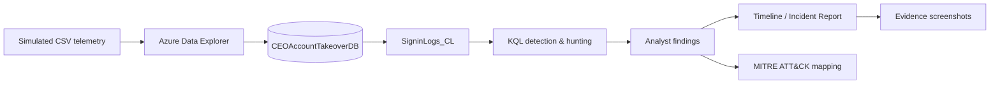

# Architecture

## Logical design

## Components

| Component | Role |
|---|---|
| Local CSV | Safe, reproducible simulated authentication telemetry |
| Azure Data Explorer | Cloud-native log storage and investigation environment |
| `CEOAccountTakeoverDB` | Dedicated project database |
| `SigninLogs_CL` | Custom table containing normalized sign-in events |
| KQL | Detection, baseline, hunting and pivot logic |
| Investigation docs | Analyst reasoning and evidence interpretation |
| Incident report | Executive-level summary, impact and recommendations |
| MITRE mapping | Adversary behavior classification |
| Evidence folder | Screenshots proving each lab stage |

## Data flow

**CSV → ADX ingestion → `SigninLogs_CL` → KQL → findings → report**

The architecture deliberately excludes Microsoft Sentinel from the core workflow because this version of the project was completed using Azure Data Explorer only.
